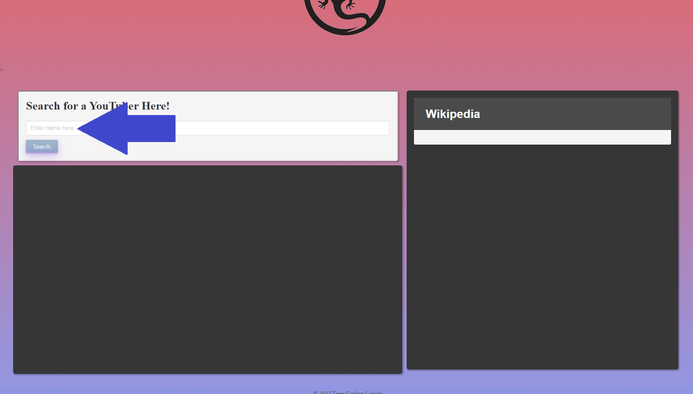
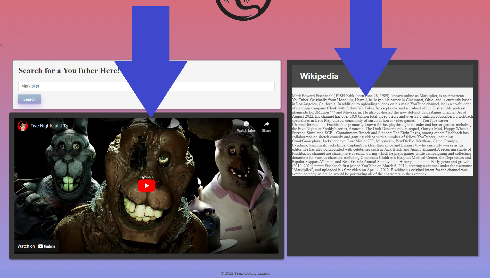

# WikiTube
## What was your motivation?
- Our motivation was to create a helpful application that will show users their favorite Youtuber's videos while simultaneously bringing up information about them on wikipedia. We thought that it was a unique idea for a duel search engine.  
## Why did you build this project?
- We built this project because we wanted to practice the skills we have learned so far with JavaScript, HTML, API's, JSON, CSS frameworks, and more. While at the same time, having fun creating a functioning application for searching 2 things at once.  
## What problem does it solve?
- Our project solves the problem of having to open a separate tab to research the YouTuber whose videos you are watching- Showing you all you need to know about them while remaining on the same page. 
## What did you learn?
- We learned how to communicate and work as a group to create a fully functioning application. We also learned more about how API's worked in this project and about other CSS frameworks such as Bulma. 

## Table of Contents
Link: https://SophiaAramburu.github.io/TeamEightProject/
- [Installation](#installation)
- [Usage](#usage)
- [Credits](#credits)
- [License](#license)
- [Features](#features)

## Installation

To look at our page click the link in our Table of Contents above!

## Usage

To search for a youtuber, put the youtuber's channel name into the search bar and click the button

Then your search result will bring up their latest video and the wikipedia information about them

## Credits

- Justin Snyder (https://github.com/JustinSnyder611)
- Martin Huerta (https://github.com/nitrammm)
- Adrian Brown (https://github.com/ninobrown585)
- Sophia Aramburu (https://github.com/SophiaAramburu)
- Armando Marquez (https://github.com/mando8828)

## License
MIT License

Copyright (c) [2022] [Sophia Aramburu]

Permission is hereby granted, free of charge, to any person obtaining a copy
of this software and associated documentation files (the "Software"), to deal
in the Software without restriction, including without limitation the rights
to use, copy, modify, merge, publish, distribute, sublicense, and/or sell
copies of the Software, and to permit persons to whom the Software is
furnished to do so, subject to the following conditions:

The above copyright notice and this permission notice shall be included in all
copies or substantial portions of the Software.

THE SOFTWARE IS PROVIDED "AS IS", WITHOUT WARRANTY OF ANY KIND, EXPRESS OR
IMPLIED, INCLUDING BUT NOT LIMITED TO THE WARRANTIES OF MERCHANTABILITY,
FITNESS FOR A PARTICULAR PURPOSE AND NONINFRINGEMENT. IN NO EVENT SHALL THE
AUTHORS OR COPYRIGHT HOLDERS BE LIABLE FOR ANY CLAIM, DAMAGES OR OTHER
LIABILITY, WHETHER IN AN ACTION OF CONTRACT, TORT OR OTHERWISE, ARISING FROM,
OUT OF OR IN CONNECTION WITH THE SOFTWARE OR THE USE OR OTHER DEALINGS IN THE
SOFTWARE.
## Features

- Youtuber Search Engine
- Wikipedia Search Engine
